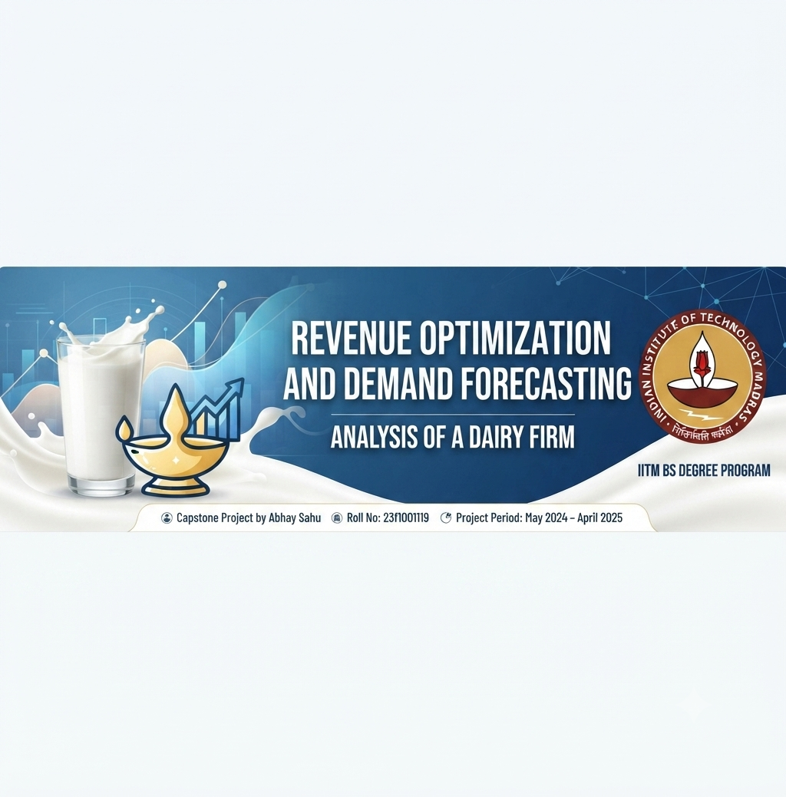

 # Revenue Optimization and Demand Forecasting - Dairy Firm
 ### A Data-Driven Study on Shree Maa Dairy (Apra Milk)

 

  

This project focuses on analyzing sales patterns, optimizing revenue, and forecasting demand for **Shree Maa Dairy (Apra Milk)**. As part of the IIT Madras BS Degree Program (Business Data Management Capstone Project), this analysis transforms raw invoice data into actionable strategic insights.

## 📊 Project Overview
Shree Maa Dairy, a regional supplier, faced challenges regarding seasonal demand fluctuations, inventory spoilage due to overstocking, and the need for a data-driven approach to reach a larger customer base. This project utilizes a full 12-month dataset (May 2024 – April 2025) to provide a roadmap for operational efficiency.

## 🛠️ Methodology
The analysis follows a structured five-step approach:
1. **Data Collection:** Primary sales data (invoices) from Shree Maa Dairy.
2. **Data Cleaning:** Handling missing values, standardizing product names, and normalizing units/dates.
3. **Exploratory Data Analysis (EDA):** Descriptive statistics, category-wise performance analysis, and trend identification.
4. **Visualization:** Pareto analysis (80/20 rule), heatmaps, and seasonal revenue trends.
5. **Predictive Modeling:** Time-series forecasting using Linear Regression and ARIMA models.

## 📈 Key Findings
*   **Seasonality:** A strong seasonal pattern exists; revenue peaks during winter/festive months (October–January) and dips during summer months (March–June).
*   **Pareto Principle:** Approximately 20% of the SKUs (e.g., Ghee Teen 15kg, Full Fat Milk Pouch) contribute to ~75-80% of total revenue.
*   **Forecasting:** ARIMA models provide reliable short-term stability analysis compared to Linear Regression, which smooths out seasonal spikes.

## 💡 Strategic Recommendations
*   **Inventory Optimization:** Aggressively stock high-margin products (Ghee, Paneer) before peak winter months.
*   **Summer Portfolio:** Enhance visibility and production of summer beverages (Lassi, Mattha) to stabilize off-peak revenue.
*   **Pareto Strategy:** Prioritize high-impact SKUs and rationalize low-performing products to optimize shelf space.
*   **Forecasting-Led Planning:** Shift from intuition-based to data-driven procurement and production planning.

## 📂 Project Structure
- `Final_Report.pdf`: Comprehensive analysis and findings.
- `Data/`: Processed monthly invoice datasets.
- `Notebooks/`: Python code used for EDA and forecasting models.

## 🎓 About
**Course:** Business Data Management (BDM) - Capstone Project
**Institute:** Indian Institute of Technology, Madras
**Student:** Abhay Sahu
